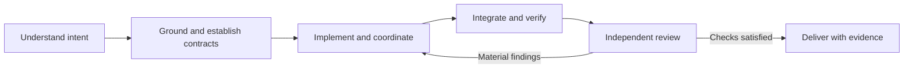

<p align="center">
  
</p>

# Reefstack

**Engineering flow without the ritual.**

[](https://github.com/thetylerreiff/reefstack/actions/workflows/checks.yml)
[](LICENSE)

Reefstack gives Codex a standing engineering workflow. You describe the outcome in ordinary conversation. It chooses how much preparation, delegation, verification, and review the task deserves.

An obvious header-color fix gets a direct edit and a focused check. A substantial feature gets shared contracts, coordinated implementation, integration checks, and fresh independent review. You don't choose a mode or remember which skill comes next.

The objective is fast delivery with correctness and maintainability preserved. That is a design goal, not a benchmark claim.

## Install

The automatic workflow uses local lifecycle hooks. Start with a current Codex desktop installation and Python 3.9 or newer available as `python3`.

Add this repository as a marketplace, then install its plugin:

```sh
codex plugin marketplace add thetylerreiff/reefstack
codex plugin add reefstack@reefstack
```

In Codex desktop, enable Reefstack and review and trust its bundled hook definition. Start a fresh engineering chat after setup. Installing the package alone does not trust its hooks; trust may need renewal after hook updates.

Once setup is complete, use normal requests:

> Change the header color to pink.

> Figure out why retrying the export creates duplicate rows. Don't change code yet.

> Build the import pipeline with validation, persistence, and progress reporting.

No special invocation is required by the intended workflow. Actual automatic activation depends on the host delivering the trusted hooks; see [verification](#verification).

For a local checkout instead:

```sh
git clone https://github.com/thetylerreiff/reefstack.git
codex plugin marketplace add ./reefstack
codex plugin add reefstack@reefstack
```

The repository includes a marketplace at `.agents/plugins/marketplace.json`, pointing to the plugin at its root.

### Supported surfaces

This is public source distributed for manual Codex desktop installation. Public GitHub distribution is separate from OpenAI's public plugin directory. Current [OpenAI packaging guidance](https://developers.openai.com/plugins/build/plugins#bundled-mcp-servers-and-lifecycle-hooks) supports manually installed desktop hooks and excludes hook-containing packages from that directory.

The procedures describe roles and contracts. Other agent hosts need their own adapter; those integrations are not implemented or validated here. Installing on the web does not deploy local Python scripts.

## How it works

The main agent owns intent, difficult boundaries, the critical path, integration, and the final result. Helpers handle independent work when the delegation triggers apply.

| Work | Expected depth |
| --- | --- |
| Small, known local change | Direct edit and a focused check. No task ledger, design exercise, delegation, or required independent review. |
| Routine bounded change | Relevant inspection and targeted checks. More rigor when a concrete uncertainty or consequence warrants it. |
| Substantial or consequential change | Proved contracts, coordinated implementation, behavioral integration checks, and fresh independent review. |

Depth depends on coupling, uncertainty, impact, and verification needs. File count and the word *feature* do not decide it. A one-line permission change can deserve more scrutiny than a large mechanical edit.

When substantial or consequential work still depends on an unresolved product choice, Reefstack pressure-tests the problem and intended outcome before technical design. It also runs when you explicitly ask to be grilled or to pressure-test an idea. The main agent asks one high-value question at a time, researches facts that can be established from available sources, and offers simpler alternatives when useful. It stops when there is a decision-ready brief covering the problem, outcome, constraints, non-goals, success criteria, and remaining assumptions. Clear requirements and small edits skip this step. The brief clarifies the work; it does not authorize implementation or expand the user's original request.



These are responsibilities, not mandatory serial steps. Independent reads, implementation, and checks can overlap. Uncertain shared contracts are resolved before dependent workers start. Repeated correctness failures return to the main agent for investigation rather than another blind retry. After Codex opens or pushes to a pull request, it attaches the same 10-minute heartbeat as the app's "Watch and fix PR" button, so checks and conflicts the pull request caused are fixed without another prompt. Pause it from the pull request panel. Settings → Git → "Pull request watch instructions" overrides its defaults.

Discussion, planning, diagnosis, and review remain read-only unless you authorize changes. Reefstack does not grant permission to deploy, alter shared data, contact people, or expand the task.

## Skills and roles

The skill names organize the implementation. They are not a vocabulary you need to learn.

| Skill | Responsibility |
| --- | --- |
| `reefstack` | Intent, task depth, routing, coordination, and completion. |
| `grill` | Pressure-test the problem and intended outcome when unresolved human choices could materially change substantial or consequential work. |
| `ground` | Relevant source, existing patterns, and uncertain integration facts. |
| `design` | Caller-first contracts, ownership, fixtures, and acceptance criteria. |
| `deliver` | Implementation, useful delegation, and continuous integration. |
| `diagnose` | Reproduction, hypotheses, root cause, and regression checks. |
| `verify` | Behavioral proof, revision-specific evidence, and coverage gaps. |
| `review` | Fresh scrutiny, material findings, and rechecking accepted fixes. |
| `setup` | Initial onboarding and installation repair. |

### Model defaults

The main agent keeps the model and reasoning effort selected in your chat. Helpers have configurable defaults:

| Role | Model | Effort |
| --- | --- | --- |
| Explorer (`explorer`) | GPT-6 Luna | Medium |
| Mechanical worker (`mechanical`) | GPT-6 Luna | Medium |
| Implementation worker (`worker`) | GPT-6 Luna | High |
| Heavy worker (`heavy_worker`): cross-cutting, concurrency, environment, debugging | GPT-6.1 Sol | High |
| Reviewer (`reviewer`) | GPT-6 Astra | High |
| Critical reviewer (`critical_reviewer`): auth, permissions, migrations, money, data deletion | GPT-6 Astra | Xhigh |

Luna's agentic coding gains flatten after high effort, and it is weak at terminal-heavy work, so hard and environment work escalates to Sol rather than to a higher Luna effort.

These are requested defaults, not guaranteed account entitlement. Custom agent profiles can override requested settings; the adapter describes that precedence. Unavailable roles should be disclosed rather than silently substituted.

Packaged defaults live in [settings.json](settings.json). Persistent overrides belong in `settings.json` under the installed plugin's `PLUGIN_DATA` directory. Partial overrides preserve unspecified defaults:

```json
{
  "models": {
    "worker": {"model": "gpt-6.1-sol", "reasoning_effort": "high"}
  }
}
```

No global model change or custom-agent registration is required. Setting `"enabled": false` in the override file suppresses Reefstack's hook context.

## Architecture

- **Core procedures:** `skills/` and `references/` describe roles, contracts, evidence, and proportional task depth.
- **Codex adapter:** `harness/codex.md`, `hooks/`, `scripts/context.py`, and `settings.json` supply host mechanics and model mapping.
- **Distribution:** `.codex-plugin/plugin.json` is the Codex manifest; `.agents/plugins/marketplace.json` makes this repository installable as a marketplace. Don't add a root `plugin.json`: Codex 0.162 loads no plugin hooks when one is present.

`SessionStart` supplies bounded standing context on startup, resume, clear, and compaction. `SubagentStart` supplies delegated-work standards without turning every helper into another coordinator.

The hooks read local packaged files and optional user settings. They do not make network calls, inspect transcripts, run models, edit your repository, rewrite global instructions, or impose a completion loop. No MCP server, API key, or third-party account is required by the hook scripts themselves.

## Verification

Run local checks from the repository root:

```sh
python3 scripts/health.py
python3 -m unittest discover -s tests -v
```

Runtime scripts and tests use the Python standard library. CI runs package health and tests, creates a standalone ZIP, and verifies its extracted contents.

The health report separates package validity and hook-script execution from installation, hook trust, native context delivery, and behavioral acceptance. A valid package is not proof that your desktop loaded it.

After installation, exercise the ordinary requests in [evaluations/cases.json](evaluations/cases.json) and inspect actual actions. Small edits should stay small. Discussion-only requests should stay read-only. A substantial change should receive integration checks and a fresh reviewer. Repeat after resume or compaction, and verify disablement in a fresh chat.

[VERIFICATION.md](VERIFICATION.md) records current checks and remaining gaps. There is no completed comparison establishing speed improvements over a single-agent workflow or PStack.

## Build a plugin archive

```sh
python3 scripts/package.py --output ../reefstack-plugin.zip
```

The archive contains one top-level `reefstack/` plugin directory with its icon, manifest, skills, hooks, and supporting files. It excludes Git history, CI configuration, the marketplace, caches, and local configuration. The builder refuses to overwrite an existing file.

## Update or disable

Refresh the marketplace and installed plugin through Codex's supported interface. Codex can load a cached copy, so changing the source directory does not necessarily update the running plugin. Check the installed version and hook trust after an update.

Use Codex's plugin controls to disable or uninstall Reefstack. Context already delivered to an open conversation remains there; verify disablement in a fresh session. The plugin does not register global agent profiles or edit global instruction files.

## Contributing

Contributions that improve real routing, integration proof, or verification are welcome. Include a realistic request or failing check that demonstrates the problem. Prefer a focused correction over another universal instruction.

See [CONTRIBUTING.md](CONTRIBUTING.md) for the development and review workflow.

## Credits and license

Inspired by [Lauren Tan's PStack](https://github.com/cursor/plugins/tree/main/pstack): caller-first contracts, clear ownership, verification on the actual artifact, independent scrutiny, and reusable tooling. Reefstack is an original implementation and is not affiliated with PStack or OpenAI.

The coral icon was generated with ImageGen. Its prompt is preserved in [assets/icon-prompt.txt](assets/icon-prompt.txt).

[MIT](LICENSE) © 2026 Tyler Reiff.
